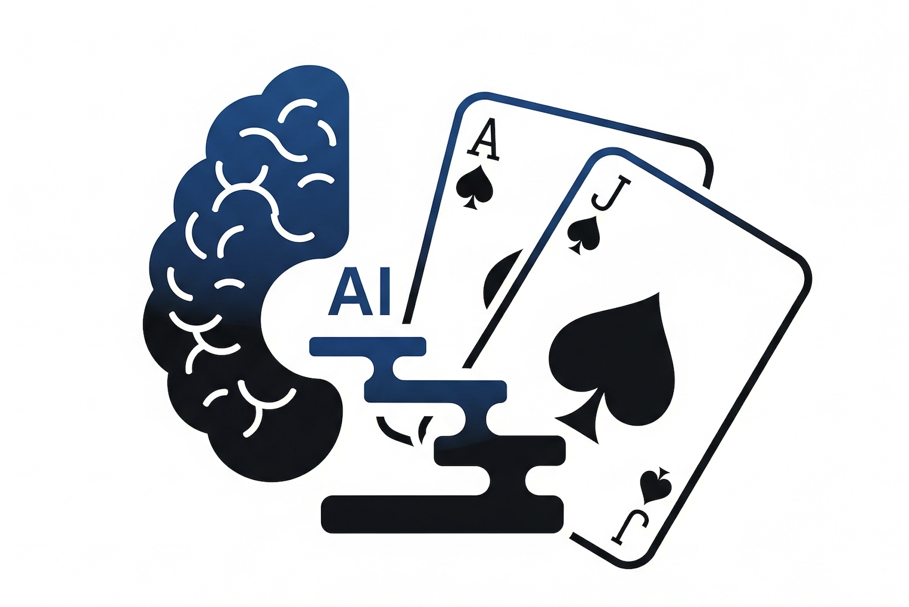

# LLM-Guided Curriculum Learning for Multi-Agent Reinforcement Learning

<div align="center">

[](https://arxiv.org/abs/2604.00076)
[](https://arxiv.org/pdf/2604.00076)
[](https://huggingface.co/papers/2604.00076)

  
</div>

A research framework for studying LLM-guided curriculum learning in multi-agent reinforcement learning (Blackjack). The system progressively unlocks actions and adjusts targets based on stage-wise performance, enabling efficient skill acquisition for DQN and Tabular Q-learning agents.

## Overview

- Curriculum stages introduce actions in increasing complexity: Stand/Hit → +Double → +Split → +Surrender/Insurance
- An LLM (Gemini) proposes stages and thresholds from concise logs (win rate, reward, error modes) and returns a JSON stage spec
- Multi-agent training: DQN with replay/target network; Tabular Q-learning baseline
- Environment: full casino rules; finite and infinite shoe; card-count features (running/true count)
- Logging: per-stage JSON; analysis scripts produce tables/plots and summaries

## Publication

**Learning to Play Blackjack: A Curriculum Learning Perspective** — Amirreza Alasti, Efe Erdal, Yücel Celik, Theresa Eimer. [arXiv:2604.00076](https://arxiv.org/abs/2604.00076) (31 Mar 2026).

- PDF: [arXiv PDF](https://arxiv.org/pdf/2604.00076)
- Citation: [`paper/CITATION.bib`](paper/CITATION.bib)

Badges above link to the abstract, PDF, and the [Hugging Face paper page](https://huggingface.co/papers/2604.00076) for this arXiv ID (create or claim the page from your HF account if it is not live yet). To surface on [Trending Papers](https://huggingface.co/papers/trending), the paper needs to be indexed on the hub and receive upvotes from the community.

## Installation

```bash
# Option A: Conda
conda env create -f environment.yml
conda activate llm-guided-curriculum-rl

# Option B: pip
python -m venv .venv && source .venv/bin/activate
pip install -r requirements.txt
```

Set your Google AI API key (for curriculum mode):
```bash
export GOOGLE_AI_API_KEY=your_key_here
```

## Reproducible Runs

### 1) Curriculum learning (LLM-guided)
```bash
# 8-deck, 90% penetration, default episodes
python scripts/curriculum_multi_agent_rl.py \
  --episodes 500000 --eval-episodes 100000 --deck-type 8-deck --penetration 0.9
```
- Produces logs under `logs/` with stage-wise evaluation and a report JSON

### 2) Standard (no curriculum)
```bash
python scripts/curriculum_multi_agent_rl.py --no-curriculum \
  --episodes 500000 --eval-episodes 100000 --deck-type 8-deck --penetration 0.9
```

### 3) Analysis
```bash
# Single run summary
python scripts/analyze_logs.py logs/<run>/run_summary_*.json

# Comparative/aggregate analysis
python scripts/analyze_logs.py --comparative logs/
```

## LLM Prompting (High-Level)

- Model: Gemini 2.0 Flash, temperature 0.2, top-p 0.9
- Prompt includes: deck config, action vocabulary and complexity, last-stage summary (win rate, avg reward, bust rate, key errors), and a strict JSON schema
- Response is validated against a schema; thresholds are clamped to [0.35, 0.50]; malformed outputs are retried with a corrective system prompt
- Offline fallback: if the key is missing or the call fails, continue using the last valid curriculum file

## Key Results (8-deck, 0.9 penetration)

- DQN achieves best performance at Stage 4 (Full Basic: Stand/Hit/Double/Split): ~49.4% win rate (vs. ~42.3% baseline without curriculum)
- Later stages adding Insurance/Surrender can reduce performance without strong count signals
- Training efficiency improves substantially vs. no-curriculum by narrowing early exploration

## Project Structure

```
llm-guided-curriculum-rl/
├── scripts/
│   ├── curriculum_multi_agent_rl.py     # main entry; curriculum and baseline
│   ├── MultiAgentStandardSystem.py      # standard training helper
│   ├── MultiAgentCurriculumSystem.py    # curriculum implementation
│   ├── RLAgent.py                       # DQN and Tabular agents
│   ├── BlackJackENV.py                  # environment with full rules
│   ├── LLM.py                           # Gemini client
│   ├── LLMGuidedCurriculum.py           # LLM-driven stage generation
│   └── analyze_logs.py                  # analysis and plots
├── logs/                                # run outputs (evaluation/training/reports/analysis)
├── paper/                               # citation (arXiv 2604.00076)
├── environment.yml / requirements.txt   # dependencies
└── README.md
```

## Configuration Notes

- Environment: `deck_type ∈ {infinite, 1-deck, 4-deck, 8-deck}`, `penetration∈(0,1)`; dealer stands on 17+
- Actions: Stand(0), Hit(1), Double(2), Split(3), Early Surrender(4), Insurance(5)
- Rewards: +1 win, 0 push, −1 loss, +1.5 blackjack; doubles multiply payout; surrender −0.5; insurance conditional payout
- DQN defaults: lr=5e-4–1e-3, target update=1k, replay=50k–100k, epsilon min=0.05

## Releasing Artifacts

- We publish: trained weights, per-stage evaluation JSONs, analysis figures
- See `logs/` for date-stamped runs and reports

## License

MIT License (see `LICENSE`).
